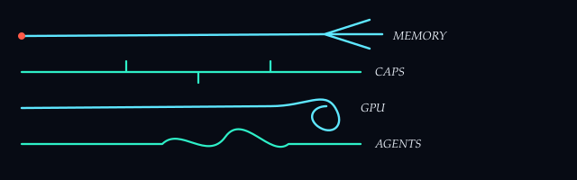

# Akasha OS

<p align="center">
  
</p>

**Language:** English | [Français](docs/fr/README.md)

**Site:** [azerothl.github.io/akasha-os](https://azerothl.github.io/akasha-os/)

**Agent-native operating system** — capability-based security, semantic IPC,
first-class GPU, offline-first. Preview builds run on a Windows/Linux host
(NVIDIA); a seL4 bare-metal track is separate.

<p align="center">
  
</p>

> This is **not** a bootable OS image yet. Preview 0.15.1 is an installable host
> app for testers (Windows/Linux/Mac Apple Silicon; NVIDIA optional on Win/Linux
> via CPU path in the same zip).

## Why Akasha OS

Most agent stacks are apps on top of a general-purpose OS. Akasha OS treats
agents, models, tools, and memory as **first-class system services** with
explicit capabilities, audit, and policy — so autonomy stays bounded and
observable.

## Preview features

Full catalogue: [docs/FEATURES.md](docs/FEATURES.md).

| Area | What you get |
|------|----------------|
| Chat / Sessions | Parallel persisted conversations; slash commands (`/image`, `/speak`); per-session model |
| Memory | Long-term facts; memory-first agent bootstrap |
| Notes | Human + agent-authored notes (WASM); resyncs on boot after an update |
| Tasks | Dual-surface tasks module + Tasks tab |
| Agents | Goal loop, skills, tools, MCP, scheduler; transparency timeline |
| Caps | List / revoke capabilities in UI |
| Models | Hardware-aware packs (incl. CPU); optional image/TTS packs (Download also installs sd.cpp / piper); metrics (TTFT / tok/s / VRAM) |
| Providers | OpenAI-compat cloud + loopback (Ollama / vLLM / LM Studio); keys in the vault |
| Network | Opt-in search (Brave / DDG / Bing) + `web.browse` + fetch |
| Settings | Language, theme, trust, routing, gpu/cpu/auto, agent defaults, search engine |
| Feedback | Local report + GitHub issue on this repo |
| Troubleshoot | In-app diagnostics; GitHub report when findings exist |
| Updates | Non-destructive overlays from GitHub Releases |

## Requirements

- Windows 10/11 x64 **or** Linux x64 **or** macOS on Apple Silicon (not Intel Mac)
- NVIDIA GPU + recent driver (`nvidia-smi -L`) on Windows/Linux **or** CPU-only mode (slower)
- ~8 GB free disk recommended (binaries + GGUF models downloaded on first run)

macOS builds are unsigned — expect Gatekeeper after download; run `install.sh`.

## Quick start

1. Download the latest zip/tar.gz from
   [GitHub Releases](https://github.com/azerothl/akasha-os/releases).
2. Run `install.ps1` (Windows) or `./install.sh` (Linux).
3. Launch **Akasha OS Preview** — first run downloads models if needed, then
   opens the in-app tutorial.

See [docs/INSTALL.md](docs/INSTALL.md) and [docs/FIRST-RUN.md](docs/FIRST-RUN.md).
Cohort protocol: [docs/TESTER.md](docs/TESTER.md).

### Developers / build from source

Full steps (toolchain, package scripts, `AOS_HOME`): [INSTALL.md — Build from source](docs/INSTALL.md#build-from-source).

```powershell
cargo test --workspace
.\packaging\build-preview.ps1 -SkipModels -RequireCuda
$env:AOS_HOME = (Resolve-Path .)
cargo run -p aos-session --release
.\demo\run-demo.ps1 -Gate p4
```

## Documentation

| Doc | Description |
|-----|-------------|
| [docs/STATUS.md](docs/STATUS.md) | **Project status** (phases & gates) |
| [docs/FEATURES.md](docs/FEATURES.md) | **Shipped Preview features** |
| [docs/INSTALL.md](docs/INSTALL.md) | Install, updates, build from source |
| [docs/PRODUCT.md](docs/PRODUCT.md) | Product brief (Impeccable) |
| [docs/FIRST-RUN.md](docs/FIRST-RUN.md) | First-run guide |
| [docs/functional-specs.md](docs/functional-specs.md) | Functional requirements |
| [docs/technical-specs.md](docs/technical-specs.md) | Architecture & APIs |
| [docs/development-plan.md](docs/development-plan.md) | Phase plan |
| [docs/vision.md](docs/vision.md) | Product vision |
| [docs/competitive-landscape.md](docs/competitive-landscape.md) | Agentic OS landscape vs Akasha OS |
| [docs/evolution-roadmap.md](docs/evolution-roadmap.md) | Post-landscape evolution priorities (E1–E15) |
| [docs/I18N.md](docs/I18N.md) | Language layout (EN / FR) |
| [CONTRIBUTING.md](CONTRIBUTING.md) | Contribution license terms |

French mirrors live under [`docs/fr/`](docs/fr/).

## Licence

**Dual licensing.**

- **AGPL-3.0-only** ([`LICENSE`](LICENSE)) — free use/modify/distribute,
  including commercially, if you honor AGPL (source available, including
  network use). Keep [`NOTICE`](NOTICE) and credit
  [Akasha OS](https://github.com/azerothl/akasha-os).
- **Commercial license** ([`LICENSE-COMMERCIAL.md`](LICENSE-COMMERCIAL.md)) —
  proprietary forks / closed SaaS. Attribution + royalty. Contact:
  loic.peaudecerf@proton.me.

The **Akasha OS** trademark is reserved.

## Status

Preview cohort (PC) is in progress. Full gate tables:
**[docs/STATUS.md](docs/STATUS.md)**.
