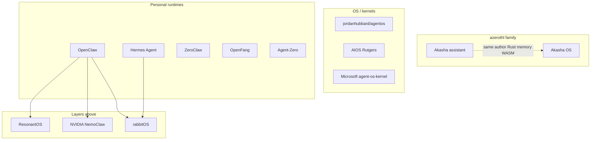

# Competitive landscape — agentic OS vs Akasha OS

**Language:** English | [Français](fr/paysage-concurrentiel.md)

> Date: 16/08/2026  
> Scope: public and related projects that call themselves an “agent OS,” agent runtime, or agentic operating layer. Marketing claims are cross-checked against README / papers where possible. Many projects use “OS” without shipping a kernel.

**Akasha OS baseline:** Preview **0.8.0** host app (Windows/Linux + NVIDIA; CPU path in the same zip), not a bootable image. Sources: [README.md](../README.md), [FEATURES.md](FEATURES.md), [vision.md](vision.md), [functional-specs.md](functional-specs.md), [STATUS.md](STATUS.md).

---

## What Akasha OS is

**Positioning:** an *agent-native* OS — agents, models, tools, and memory as first-class system services, not an app bolted onto POSIX. Preview 0.11.0 runs on a host; a separate seL4 track (PV.1–PV.3) scaffolds bare metal.

**Shipped on the host:**

- Logical then native capabilities (`aos-caps` / `aos-capkd`)
- Semantic IPC (CBOR, typed intents)
- Agent runtime (goal loop, skills, MCP, sub-agents, steer / pause)
- Long-term + episodic memory with memory-first bootstrap
- Dual-surface WASM modules (notes for humans and agents)
- Host-rendered declarative module UI (E15; no webview)
- Local models (llama.cpp CUDA), VRAM-tier packs, continuous batching, optional OpenAI-compatible remote
- Offline-first, egress deny-by-default, fail-closed confirmation, hashed audit
- Trust manager + `cap.request`, declarative policy
- egui UI: chat, agents, memory, notes, models, audit, settings (EN/FR)

**Not in Preview:** bootable image, macOS, marketplace, multi-user, full multi-GPU, native audio/video.

---

## Taxonomy — do not compare apples and oranges

| Layer | Definition | Examples |
|-------|------------|----------|
| **A. Agent-native OS / microkernel** | Hardware isolation, capabilities, IPC, possibly boot | Akasha OS, [jordanhubbard/agentos](https://github.com/jordanhubbard/agentos) |
| **B. Research / governance kernel** | “OS-like” services on top of Linux | [AIOS](https://github.com/agiresearch/AIOS) (~6k★), [agent-os-kernel](https://pypi.org/project/agent_os_kernel/) (Microsoft), AOS paper (arXiv:2608.03214) |
| **C. Personal “agent OS” runtime** | Userspace daemon: gateway, tools, memory, channels | [Akasha](https://github.com/azerothl/akasha) (sibling), [OpenClaw](https://openclaw.ai/) (~386k★), Hermes, ZeroClaw, OpenFang, Agent-Zero |
| **D. Experience / fleet layer** | Dashboard, governance, economy on top of a runtime | ResonantOS, Knowlee, clawREFORM |
| **E. Device / computer-use** | GUI control or consumer device OS | Adept ACT-1, rabbitOS 2.3, Windows + OpenClaw / WSL-C |

Agent *frameworks* (LangGraph, CrewAI, AutoGen) are **not** OS projects and are excluded from the matrix.

Do not confuse [azerothl/akasha](https://github.com/azerothl/akasha) with [ocuil/akasha-public](https://github.com/ocuil/akasha-public) (stigmergic memory fabric, different author).

---

## Related project: Akasha (azerothl/akasha)

**Not a competitor.** Same author (`azerothl`), same brand family, Rust stack. GitHub repo is currently **private** (public 404). Workspace version **0.10.0**. License: proprietary / TBD.

**Positioning:** a **secure, local-first, 24/7** personal assistant — agentic infrastructure *on* a host OS. Layer **C**, the internal peer of OpenClaw / Hermes, **not** of Akasha OS.

**Rust monorepo (high level):** `akasha-core`, `akasha-daemon` (API :3876), `akasha-cli` / `akasha-tui`, `akasha-store` (SQLite + immutable log), `akasha-vault`, `akasha-llm` (router + fallback), `akasha-embedded-llm`, `akasha-embeddings`, `akasha-tools` + policy YAML, `akasha-plugin-host` (Wasmtime), `akasha-rag`, `akasha-cluster` (NATS), `akasha-calendar`, `akasha-workspace-graph`. UI: Tauri + React. Satellites: site app, code studio.

**Shipped surface (phases 0–9+):** always-on daemon, non-blocking orchestrator, Slack / Discord / Telegram, short- and long-term memory (typed relation graph), vault / RBAC / redaction, WASM plugins, LLM router (embedded / Ollama / OpenAI / OpenRouter), cluster, RAG + doctor advice, TTS/STT, Home Assistant, service discovery, CPU-capable path.

| | Akasha (assistant) | Akasha OS (Preview 0.11.0) |
|--|--------------------|---------------------------|
| Thesis | 24/7 guest on Windows/Linux | Agent-native OS (caps, IPC, seL4) |
| Isolation | Tool policy + WASM + vault | Native caps `aos-capkd` + WASM without ambient WASI |
| IPC | HTTP daemon :3876 + event envelope | CBOR intent bus :24701 |
| GPU / placement | Router + Ollama / embedded; no OS Placement Manager | `modeld` + VRAM packs + continuous batching |
| Offline | Embedded + degraded mode | `offline_strict` deny-by-default |
| Channels | Slack / Discord / Telegram | none |
| Always-on / cron | daemon + calendar + tasks | background agents only |
| Voice / HA / cluster | yes | no |
| Dual-surface modules | WASM plugins (tools) | `.aospkg` human + agent (notes + `declarative_ui`) |
| UI | TUI + Tauri React | native egui |
| License | proprietary | AGPL + commercial |
| Maturity | v0.10.0, broader product surface | Preview 0.11.0, deeper OS thesis |

**Reading:** Akasha already covers much of what OpenClaw/Hermes sell (channels, 24/7, vault, router, CPU). Akasha OS does **not** try to clone that layer: it moves one layer up (caps, semantic IPC, GPU-as-service, seL4). Gaps of Akasha OS vs market layer C already exist in the sibling — prefer reuse over reimplementation, without diluting the OS thesis.

Plausible reuse (documentation only; not a merge in this doc): memory + typed graph, vault, channels, LLM router, Wasmtime plugins, calendar/tasks.

---

## Closest OS peer: jordanhubbard/agentos

The only public project that aims at the **same object** as Akasha OS: bootable seL4 OS, capabilities, agents as first-class citizens — not a Python framework. (The sibling Akasha aims at the assistant, not the kernel.)

| | Akasha OS | agentOS (Hubbard) |
|--|-----------|-------------------|
| Kernel | seL4 planned; Preview on host + `aos-capkd` | seL4 Microkit, QEMU boot proven |
| Caps | `aos-capkd` mint/grant/revoke **already on host** | ToolCap/ModelCap/MemCap; agent services still mostly host-tested scaffolding |
| IPC | semantic CBOR intents | Microkit C contracts |
| Inference / GPU | first-class (placement, batching, VRAM packs) | not the focus |
| Human UI | egui Preview, dual-surface | “no human UI required”; GUI in another repo |
| Product maturity | installable Preview 0.11.0 | ~20★, kernel boot yes, agent layer still scaffolding |
| License | AGPL + commercial | public repo, small |

**Reading:** Akasha OS is **ahead on agent product + GPU + UI**; agentOS is **ahead on bare-metal boot**. Peers, not OpenClaw clones.

---

## Personal runtimes (where the market is)

### OpenClaw — de facto standard

Local gateway, 20–29 channels (WhatsApp, Telegram, Discord, Slack, Signal, iMessage, …), `SKILL.md` + ClawHub, SQLite memory, cron, browser, voice, canvas, optional Docker sandbox (`main` session often **unsandboxed**). Native Windows via Execution Containers (Build 2026). Microsoft / NVIDIA plug in.

**Vs Akasha OS:** OpenClaw wins on ecosystem, channels, always-on, light computer-use, community. Akasha OS wins on native caps, semantic IPC, GPU/placement, offline-strict, fail-closed audit, dual-surface modules. OpenClaw remains an **app on the host OS** (the claim [website/why.html](../website/why.html) rejects). The sibling Akasha is closer to OpenClaw than to Akasha OS on this layer.

### Hermes Agent (Nous Research)

Self-improving loop (auto-created skills), cross-session memory, Honcho user modeling, cron, sub-agents, multiple execution backends (local, Docker, SSH, Modal, Daytona, …), MCP, TUI + Desktop, native Windows. Not an OS: a portable self-improving agent.

**Vs Akasha OS:** Hermes wins on continuous learning, portability, channels, serverless. Akasha OS wins on cap isolation, first-class local models, kernel-level policy/audit. The sibling Akasha overlaps Hermes on 24/7 daemon, LT memory, slash commands, multi-channel.

### ZeroClaw / OpenFang / clawREFORM

Rust “single binary” alternatives around the OpenClaw niche: lean runtime, SOPs, crypto receipts (ZeroClaw); aggressive security/WASM/channel claims (OpenFang); self-rewrite + A2A (clawREFORM).

**Vs Akasha OS:** same layer C. Their WASM/allowlist security claims are closer to Akasha OS (and the sibling’s Wasmtime plugin host) than OpenClaw’s optional sandbox, but **no** seL4 kernel, OS-level GPU placement, or dual-surface modules.

### Agent-Zero

Docker = full Linux desktop for the agent (GUI + terminal + annotated browser) + host bridge. Strong computer-use.

**Vs Akasha OS:** Agent-Zero *drives* a general-purpose OS; Akasha OS *aims to be* the OS. No native caps / semantic IPC / GPU-as-service.

---

## Research and governance

### AIOS (Rutgers, COLM 2025, arXiv:2403.16971)

Userspace kernel: agent scheduling, LLM context switch, memory/storage/tool managers, Cerebrum SDK. Up to ~2.1× vs naive execution. ~6k★. Already cited in [vision.md](vision.md).

**Vs Akasha OS:** same intuition (services kernel). AIOS = Python research on Linux, multi-framework. Akasha OS = caps + semantic IPC + dual-surface WASM + GPU placement + seL4 track + usable Preview.

### Microsoft agent-os-kernel

**Governance** kernel (policy, trust, observability, IATP), PyPI preview — not a desktop OS. Complementary, not a product competitor.

### AOS paper (arXiv:2608.03214)

Reference architecture (control plane + runtime plane). Useful as an evaluation grid, not a product.

---

## Platforms and devices

- **NVIDIA NemoClaw:** install/sandbox local agents on RTX / DGX, Hermes option, WSL. Vendor infra, not a sovereign OS.
- **Windows 2026:** OpenClaw in Execution Containers, WSL-C. The general-purpose OS *hosts* agents; Akasha OS inverts that relationship.
- **rabbitOS 2.3:** consumer multi-agent on R1 (Hermes + OpenClaw + DLAM computer controller). Device OS, not a sovereign desktop.
- **Adept ACT-1:** enterprise computer-use / action models. No kernel, no OS memory, no offline-first local stack.
- **ResonantOS / Knowlee:** cockpit, RAG, governance, sometimes token/DAO. Layer D.

---

## Feature matrix

Legend: **yes** / **partial** / **no** / **vision**. Column **Akasha** = sibling [azerothl/akasha](https://github.com/azerothl/akasha) v0.10.0, **not** the OS. Akasha OS cells are **shipped Preview** unless marked vision.

| Capability | Akasha OS | Akasha | agentOS seL4 | AIOS | OpenClaw | Hermes | ZeroClaw / OpenFang | Agent-Zero |
|------------|-----------|--------|--------------|------|----------|--------|---------------------|------------|
| Real kernel / HW isolation | partial (host + seL4 track) | no | yes (QEMU boot) | no | no | no | no | Docker |
| Unforgeable caps / revoke | yes | partial (policy + vault) | vision/partial | partial (ACL) | partial (opt. sandbox) | partial | partial–yes (claims) | no |
| Semantic IPC / syscalls | yes | HTTP + events | C contracts | agent syscalls | no (tools) | no | no | no |
| First-class GPU + placement | yes | partial (Ollama/CUDA) | no | no | no | no | no | no |
| Offline-first + embedded models | yes | yes (embedded + degraded) | n/a | partial | partial (BYO local) | partial | partial | partial |
| Egress deny-by-default | yes | partial (tool policy) | n/a | no | no (host default) | no | partial | Docker-isolated |
| Hashed audit + fail-closed confirm | yes | immutable log + approvals | planned | partial | partial | partial | receipts (ZC) | partial |
| Trust / graduated autonomy | yes | trust store + RBAC | no | no | no | learning loop | conscience (claims) | no |
| LT memory + bootstrap | yes | yes (typed graph) | no | yes | yes | yes (richer) | yes | yes |
| Dual-surface WASM modules | yes | WASM plugins | no | no | skills md | skills | plugins | plugins |
| Skills / MCP | yes | skills + plugins | no | tools SDK | yes + ClawHub | yes | yes | yes |
| Multi-agent spawn / steer | yes | orchestrator + workers | vision | yes | routing | sub-agents | yes | yes |
| Chat channels (TG/Discord/…) | no | Slack/Discord/Telegram | no | no | **yes (20+)** | yes | yes | no |
| Computer-use / GUI | no | machine tools | no | no | browser | tools | browser | **yes (desktop)** |
| Always-on / cron | partial (bg agents) | **yes** (daemon + calendar) | no | scheduler | **yes** | **yes** | SOP/cron | no |
| macOS / CPU-only | no | yes (CPU / Ollama) | QEMU | yes | yes | yes | yes | yes |
| Marketplace | no (v1 local) | plugin registry | no | agents hub | ClawHub | skills | ClawHub-compat | no |
| Maturity / reach | Preview 0.2 | v0.10.0 private | proto | research | **mass product** | product | emerging | mature framework |

---

## Strategic reading for Akasha OS

**Akasha OS is not behind on “agentic OS” in the kernel sense.** On that definition (caps, semantic IPC, GPU-as-service, audit, dual-surface WASM, seL4), the only public peer is agentOS — and Akasha OS has a more complete human Preview.

**The “personal assistant” lag (layer C)** vs OpenClaw / Hermes is largely **already covered by the sibling Akasha** (channels, 24/7 daemon, vault, calendar, voice, CPU/Ollama). That is not a family gap; it is a *deliberate* Akasha OS gap if the thesis stays the kernel.

Four structural deltas:

1. **OS thesis vs assistant thesis** — OpenClaw and sibling Akasha accept being powerful guests; Akasha OS does not. Do not merge both products into one binary.
2. **Inference as an OS resource** — neither the sibling nor layer-C runtimes have a Placement Manager + continuous batching + VRAM packs. Clearest OS differentiator.
3. **Dual surface** — human+agent notes WASM (OS) vs tools-only WASM plugins (sibling). Same Wasmtime runtime, different contract.
4. **Brand** — two Rust “Akasha” products from the same author: keep sibling vs OS clear (and distinct from ocuil/akasha-public).

Risks: (a) Hubbard/agentos catches up on the agent layer on seL4; (b) Windows+OpenClaw+NemoClaw normalizes agent-in-container; (c) Preview cohort stays NVIDIA-only while the sibling already does CPU; (d) duplicated memory/WASM/router work across repos if no bridge is decided.

Prioritized product responses (E1–E15, anti-roadmap): [evolution-roadmap.md](evolution-roadmap.md).

---

## Sources (August 2026)

- Akasha OS: this repo — README, FEATURES, STATUS, vision, functional specs
- Sibling Akasha: [github.com/azerothl/akasha](https://github.com/azerothl/akasha) (private), local README / `spec/00_vision.md`
- [jordanhubbard/agentos](https://github.com/jordanhubbard/agentos)
- [agiresearch/AIOS](https://github.com/agiresearch/AIOS), arXiv:2403.16971
- [openclaw.ai](https://openclaw.ai/), [openclaw/openclaw](https://github.com/openclaw/openclaw)
- [NousResearch/hermes-agent](https://github.com/nousresearch/hermes-agent)
- [zeroclaw-labs/zeroclaw](https://github.com/zeroclaw-labs/zeroclaw), [RightNow-AI/openfang](https://github.com/rightnow-ai/openfang), [aegntic/clawreform](https://github.com/aegntic/clawreform)
- [agent0ai/agent-zero](https://github.com/agent0ai/agent-zero)
- [agent-os-kernel](https://pypi.org/project/agent_os_kernel/) (Microsoft)
- AOS reference architecture: arXiv:2608.03214
- NVIDIA NemoClaw / Windows agent tooling (vendor blogs, ComputeX / Build 2026)
- rabbitOS 2.x release notes; Adept computer-use coverage
- ResonantOS, Knowlee (layer D positioning)

Do **not** invent GitHub star counts for `azerothl/akasha` (private repo).
