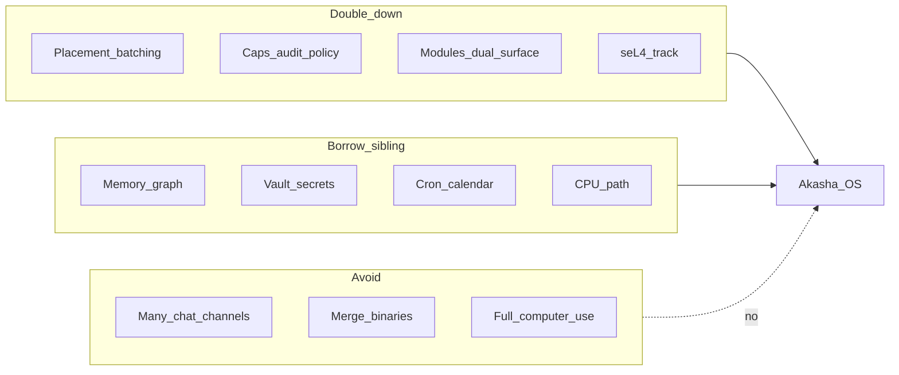

# Evolution roadmap — Akasha OS (post-landscape)

**Language:** English | [Français](fr/plan-evolutions.md)

> Date: 16/08/2026  
> Status: prioritization layer (not a new P6 phase number)  
> Derived from: [competitive-landscape.md](competitive-landscape.md)  
> Relates to: [development-plan.md](development-plan.md), [FEATURES.md](FEATURES.md), [STATUS.md](STATUS.md), [vision.md](vision.md)

This document proposes **product evolutions (E1–E13)** after the August 2026 competitive survey. It does **not** replace P0–P5 / PV / PC. Close the PC cohort gate first; then schedule E* work on top of remaining P5 / PV deliverables.

---

## Guiding principle

From [competitive-landscape.md](competitive-landscape.md):

- **Do not merge** Akasha OS and the sibling [Akasha](https://github.com/azerothl/akasha) assistant into one binary.
- **Do not chase** OpenClaw’s 20+ chat channels inside the OS kernel product.
- **Double down** on what layer-C runtimes lack: GPU placement + batching, native capabilities, semantic IPC, dual-surface WASM, seL4 track.
- For channels / 24/7 voice / rich CPU assistant UX: **reuse or bridge** the sibling, do not reimplement.

---

## Horizon A — Near term (Preview 0.3.0 — shipped)

Goal: wider tester cohort + clearer OS differentiator, without becoming OpenClaw.

| ID | Evolution | Competitive motivation | Repo anchor |
|----|-----------|------------------------|-------------|
| **E1** | **Explicit CPU-only / low-VRAM path** | Sibling + Hermes/OpenClaw run without NVIDIA; landscape risk (c) | [FEATURES.md](FEATURES.md); first-run packs; `cpu` tier; packaging `-CpuOnly` |
| **E2** | **OS agent scheduler**: cap-gated `schedule.*` intents (not chat channels) | OpenClaw/Hermes/sibling win on always-on | `aos-agentd` + Settings UI + `var/schedules/` |
| **E3** | **Second dual-surface module** (`tasks`) | Rare differentiator vs skills-md-only stacks | [modules/tasks](../modules/tasks) + Tasks tab |
| **E4** | **Readable caps surface**: list + revoke from UI | ZeroClaw receipts / MS governance | egui Caps tab + `aos-capkd` |
| **E5** | **GPU metrics in UI** (TTFT, tok/s, VRAM) | Prove Placement Manager claim | `model.metrics`; sidebar + Models |

**Status:** E1–E5 implemented in Preview **0.3.0** — [phase-preview-03.md](phases/phase-preview-03.md).  
E6 / E7-lite / E10-lite shipped in Preview **0.4.0** — [phase-preview-04.md](phases/phase-preview-04.md).  
E14 shipped in Preview **0.5.0** — [phase-preview-05.md](phases/phase-preview-05.md).  
E8 schema export + HTTP↔bus contract, E7 OS keyring, E10 signed local catalogue ship in Preview **0.6.0** — [phase-preview-06.md](phases/phase-preview-06.md).

**Out of near-term scope:** native Telegram/Discord, public marketplace, desktop computer-use.

---

## Horizon B — Medium term (v0.x → v1 host)

| ID | Evolution | Motivation | Notes |
|----|-----------|------------|-------|
| **E6** | **Typed memory graph** (`similar` / `updates` / …) + richer bootstrap | Sibling already rich; Hermes LT; A-MEM | **Shipped 0.4.0** — conceptual borrow of sibling `memory_relations`, not a code merge |
| **E7** | **Secrets vault** (OS keyring + usage caps; never raw keys to agents) | Sibling vault; F-SEC-04 | **E7-lite 0.4.0** (`vault.enc` + DPAPI/0600); **E7-keyring 0.6.0** (CredMan / Secret Service, file 0600 fallback); full TPM later |
| **E8** | **Sibling bridge** (documented + minimal): aligned intent / memory / WASM ABI schemas; later optional “Akasha assistant as module” | Landscape risk (d) duplication | **Docs 0.4.0** — [sibling-bridge.md](sibling-bridge.md); **schema export + HTTP↔bus contract 0.6.0**; **not** one binary |
| **E9** | **P5.2 multi-GPU** when hardware is available | Partial P5 gate | [phases/phase-p5.md](phases/phase-p5.md) |
| **E10** | **Local MCP / module marketplace** (signed catalogue, cap review) | ClawHub-shaped distribution without becoming ClawHub | **E10-lite 0.4.0** — cap review on install + MCP example; **signed local catalogue 0.6.0**; no network store |
| **E14** | **Auto fact extraction from chat → long-term memory** | Chat today only *reads* `mem.context`; facts must be Remember’d by hand | **Shipped 0.5.0** — opt-in Settings; post-turn LLM extract → `mem.user.remember` + dedup/`supersedes`; never auto-store secrets |

---

## Horizon C — Long term (bare-metal product)

| ID | Evolution | Motivation |
|----|-----------|------------|
| **E11** | **PV.4+ → bare metal**: same image, AccelDevice (P5.3) | Peer Hubbard/agentos; the real OS race |
| **E12** | **Preemptive cognitive context switch** (F-AGT-03) | AIOS context manager; OS claim |
| **E13** | **Compositor / dual UI** beyond Preview egui | [vision.md](vision.md) §7; not priority while host Preview is the product |

---

## Anti-roadmap (do not do)

- Clone 20+ messaging channels into the OS product core → leave to the sibling or a later optional module.
- Merge `akasha` + `akasha-os` into one binary → brand confusion + diluted thesis.
- Prioritize Adept/Agent-Zero-style computer-use before caps + GPU + seL4.
- Public marketplace before a local registry with capability attestation.

---

## Relationship to phase plan

| Layer | Role |
|-------|------|
| **P0–P5 / PV / PC** | Executable phase gates ([development-plan.md](development-plan.md), [STATUS.md](STATUS.md)) |
| **E1–E14** | Prioritization after competitive analysis; schedule **after** PC cohort gate closes |

Do **not** invent a P6 number until PC is closed and STATUS is updated. E1–E5 shipped in Preview **0.3.0**; E6 / E7-lite / E10-lite shipped in Preview **0.4.0**; **E14** shipped in Preview **0.5.0**; E8 schemas + E7-keyring + E10 catalogue shipped in Preview **0.6.0**. Next focus: remaining Horizon B (full E7 TPM, live HTTP adapter if a daemon is scheduled, E9 multi-GPU when HW available) + PC cohort close.

Suggested sequencing once PC closes:

1. E5 (metrics) + E4 (caps UI) — prove OS thesis in the tester UI  
2. E1 (CPU path) — widen cohort  
3. E2 (scheduler) + E3 (second dual-surface module)  
4. Then Horizon B (E6–E10) in parallel with remaining P5.2 / PV work  

---

## Related documents

- [competitive-landscape.md](competitive-landscape.md) — survey that motivates E*
- [development-plan.md](development-plan.md) — phase gates P0–P5 / PV / PC
- [FEATURES.md](FEATURES.md) — shipped Preview surface
- [functional-specs.md](functional-specs.md) — F-* requirements (esp. F-AGT-03, F-SEC-04, F-PLC-*)
- [phases/phase-p5.md](phases/phase-p5.md), [phases/phase-vm-sel4.md](phases/phase-vm-sel4.md), [phases/phase-pc.md](phases/phase-pc.md)
- Sibling: [github.com/azerothl/akasha](https://github.com/azerothl/akasha) (private)
