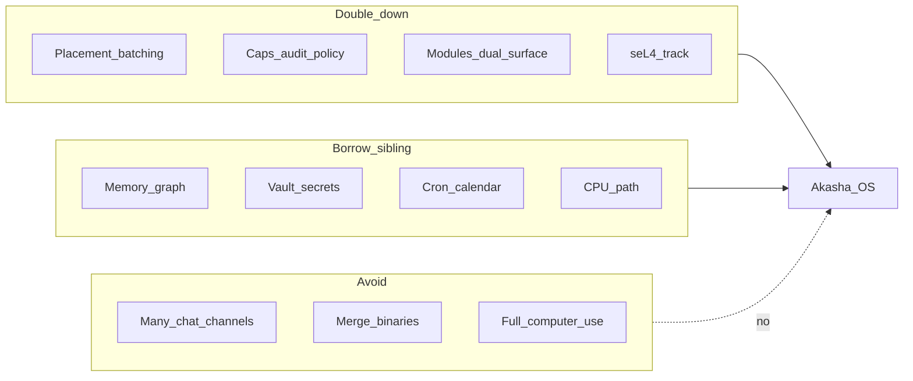

# Evolution roadmap — Akasha OS (post-landscape)

**Language:** English | [Français](fr/plan-evolutions.md)

> Date: 13/09/2026  
> Status: prioritization layer (not a new P6 phase number)  
> Derived from: [competitive-landscape.md](competitive-landscape.md)  
> Relates to: [development-plan.md](development-plan.md), [FEATURES.md](FEATURES.md), [STATUS.md](STATUS.md), [vision.md](vision.md)

This document proposes **product evolutions (E1–E23)** after the August 2026 competitive survey. It does **not** replace P0–P5 / PV / PC. Close the PC cohort gate first; then schedule E* work on top of remaining P5 / PV deliverables. Preview increments (P03–P09) already ship E* on the host without waiting for that cohort gate.

---

## Guiding principle

From [competitive-landscape.md](competitive-landscape.md):

- **Do not merge** Akasha OS and the sibling [Akasha](https://github.com/azerothl/akasha) assistant into one binary.
- **Do not chase** OpenClaw’s 20+ chat channels inside the OS kernel product.
- **Double down** on what layer-C runtimes lack: GPU placement + batching, native capabilities, semantic IPC, dual-surface WASM, seL4 track.
- For channels / 24/7 voice / rich CPU assistant UX: **reuse or bridge** the sibling, do not reimplement.

---

## Horizon A — Near term (Preview 0.3.0 — shipped)

Goal: wider tester cohort + clearer OS differentiator, without becoming OpenClaw.

| ID | Evolution | Competitive motivation | Repo anchor |
|----|-----------|------------------------|-------------|
| **E1** | **Explicit CPU-only / low-VRAM path** | Sibling + Hermes/OpenClaw run without NVIDIA; landscape risk (c) | [FEATURES.md](FEATURES.md); first-run packs; `cpu` tier; packaging `-CpuOnly` |
| **E2** | **OS agent scheduler**: cap-gated `schedule.*` intents (not chat channels) | OpenClaw/Hermes/sibling win on always-on | `aos-agentd` + Settings UI + `var/schedules/` |
| **E3** | **Second dual-surface module** (`tasks`) | Rare differentiator vs skills-md-only stacks | [modules/tasks](../modules/tasks) + Tasks tab |
| **E4** | **Readable caps surface**: list + revoke from UI | ZeroClaw receipts / MS governance | egui Caps tab + `aos-capkd` |
| **E5** | **GPU metrics in UI** (TTFT, tok/s, VRAM) | Prove Placement Manager claim | `model.metrics`; sidebar + Models |

**Status:** E1–E5 implemented in Preview **0.3.0** — [phase-preview-03.md](phases/phase-preview-03.md).  
E6 / E7-lite / E10-lite shipped in Preview **0.4.0** — [phase-preview-04.md](phases/phase-preview-04.md).  
E14 shipped in Preview **0.5.0** — [phase-preview-05.md](phases/phase-preview-05.md).  
E8 schema export + HTTP↔bus contract, E7 OS keyring, E10 signed local catalogue shipped in Preview **0.6.0** — [phase-preview-06.md](phases/phase-preview-06.md).  
**E15** (host-rendered declarative module UI) shipped in Preview **0.7.0** — [phase-preview-07.md](phases/phase-preview-07.md).  
**E16 + E17 + E15 widget pack + F-MDL-04 Providers** shipped in Preview **0.8.0** — [phase-preview-08.md](phases/phase-preview-08.md).  
**E18 + E19** shipped in Preview **0.9.0**. **E7 TPM + E8 live + E9 path + Media polish** shipped in **0.10.0**. **E20 local decode** shipped in Preview **0.11.0** (P11). PC cohort close remains after 0.11.

**Out of near-term scope:** native Telegram/Discord, public marketplace, desktop computer-use, `sandboxed_webview`.

---

## Horizon B — Medium term (v0.x → v1 host)

| ID | Evolution | Motivation | Notes |
|----|-----------|------------|-------|
| **E6** | **Typed memory graph** (`similar` / `updates` / …) + richer bootstrap | Sibling already rich; Hermes LT; A-MEM | **Shipped 0.4.0** — conceptual borrow of sibling `memory_relations`, not a code merge |
| **E7** | **Secrets vault** (OS keyring + usage caps; never raw keys to agents) | Sibling vault; F-SEC-04 | **E7-lite 0.4.0** (`vault.enc` + DPAPI/0600); **E7-keyring 0.6.0** (CredMan / Secret Service, file 0600 fallback); **E7 TPM envelope Preview 0.10.0** (host Win/Linux; no PCR) |
| **E8** | **Sibling bridge** (documented + minimal): aligned intent / memory / WASM ABI schemas; later optional “Akasha assistant as module” | Landscape risk (d) duplication | **Docs 0.4.0** — [sibling-bridge.md](sibling-bridge.md); **schema export + HTTP↔bus contract 0.6.0**; **live `aos-bridged` Preview 0.10.0**; **not** one binary |
| **E9** | **P5.2 multi-GPU** when hardware is available | Partial P5 gate | [phases/phase-p5.md](phases/phase-p5.md); **code path + skip-if-1-GPU in Preview 0.10.0** |
| **E10** | **Local MCP / module marketplace** (signed catalogue, cap review) | ClawHub-shaped distribution without becoming ClawHub | **E10-lite 0.4.0** — cap review on install + MCP example; **signed local catalogue 0.6.0**; **opt-in signed Git extra source** (`community/catalogue.yaml`, cap review, not a public store) |
| **E14** | **Auto fact extraction from chat → long-term memory** | Chat today only *reads* `mem.context`; facts must be Remember’d by hand | **Shipped 0.5.0** — opt-in Settings; post-turn LLM extract → `mem.user.remember` + dedup/`supersedes`; never auto-store secrets |
| **E15** | **Host-rendered declarative module UI** (closed widget tree in egui; no webview) | Dual-surface is a contract today; Notes/Tasks are hardcoded; agent-created modules have no human surface | **Preview 0.7.0** ✅ — [phase-preview-07.md](phases/phase-preview-07.md); **0.8.0 P08.11** expands the closed list (typed `form`, `select`/`radio`/`checkbox`/`textarea`, `bar_chart`, `image`/`audio`); still **not** HTML/JS; **not** E13 |
| **E16** | **Local image + audio (TTS) generation** | Testers expect multimodal output without a hosted API | **Preview 0.8.0** ✅ — [phase-preview-08.md](phases/phase-preview-08.md); optional packs; Download fetches sd.cpp / piper into `bin/`; Placement Manager owns VRAM vs the LLM; cap `media.generate`; **not** video; **not** always-on STT/voice (sibling); extra families / CLI options = **E19 / 0.9** |
| **E17** | **Unified CPU/GPU host artefact** + live device policy | Testers used to pick a CUDA zip or a CPU zip; Settings auto/gpu/cpu only applied on next boot | **Preview 0.8.0** ✅ — one artefact per OS; session spawns a CUDA-safe or CPU-safe backend; UI switch restarts modeld; **auto** = Placement Manager hysteresis on VRAM/CPU (and E16); pin overrides; `-CpuOnly` = builder-only; **mid-token without cancel = E18 / 0.9** |
| **E18** | **Mid-token device migrate** (CPU ↔ GPU, stream continues) | 0.8 switch cancelled the live infer | **Preview 0.9.0** ✅ — [phase-preview-09.md](phases/phase-preview-09.md); prefix replay; fail-closed fallback to 0.8 cancel+restart |
| **E19** | **Extensible local media** (extra image models + closed sd.cpp / Piper options + chat media plugins) | 0.8 hard-coded SD 1.5 at 512² / 20 steps and two Piper voices | **Preview 0.9.0** ✅ — [phase-preview-09.md](phases/phase-preview-09.md); closed JSON schema; Flux2/Ideogram4/extra Piper; Image studio + in-chat TTS card; **not** video; **not** img2img as a first-class intent |
| **E20** | **Local decode levers** (KV Q8, `llama_state_*` prefix cache, prompt-lookup speculative on C1) | Chat/agent TTFT + tok/s without adopting vLLM | **Preview 0.11.0** ✅ — [phase-preview-11.md](phases/phase-preview-11.md); C1 only; batch N>1 unchanged; no second draft GGUF |
| **E21** | **Placement bandwidth + semantic prefix anchors** (FreeToken-inspired, not a dependency) | MoE/edge papers stress transfer vs compute; agent edits invalidate KV at arbitrary tokens | **Preview 0.11.0** ✅ — [phase-preview-11.md](phases/phase-preview-11.md) §E21; measured RAM + `nvidia-smi`/PCIe estimates in `hardware.json` → `HardwareProfile`; E20 prefix snaps to turn/tool/think markers; **MoE per-expert LRU out of scope** — see [moe-expert-offload.md](moe-expert-offload.md) |
| **E22** | **Instincts** — atomic learned procedures with confidence, scoped injection, human promote-to-skill | Hermes / ECC continuous-learning; Preview `skill.pass` only clusters **user asks** into a full skill card | **P18** ✅ — [phase-preview-18.md](phases/phase-preview-18.md). Extends 0.15 `skill.pass`; does **not** replace it. See §E22 below. |
| **E23** | **Runtime health plane** — ephemeral canary, SLO/EWMA, Isolation Forest residual, stderr clusters | Watchdogs cover process death only; “alive but wrong” (AK-001) needs contracts + drift signals without a second always-on GGUF | **P19** ✅ — [phase-preview-19.md](phases/phase-preview-19.md). See §E23 below. |

---

## E22 — Instincts (P18)

Same product family as the Preview **0.15 morning skill offer**, not a second learning product.

| Layer already shipped | What it captures | What it produces | When it fires |
|-----------------------|------------------|------------------|---------------|
| **E14** (0.5.0) | Facts about the user | Long-term memory graph | Opt-in post-turn extract |
| **`skill.pass`** (0.15) | Repeated **user asks** (≥3 similar messages, Jaccard / domain buckets) | One morning card: Create \| Later — **never auto-creates** a `SKILL.md` | Nightly 02:00–04:00 local; surface after 05:00 (**catch-up**) |
| **E22** (P18) | Repeated **agent procedures** + human corrections | Atomic instincts (trigger + action + confidence), injected into the **same** conversation once context is high; optional promote into the existing skill card | **Primary: in-session on context pressure** (and steer). Nightly `skill.pass` stays a catch-up only. |

`skill.pass` answers “you keep asking for the weather — want a skill?”. E22 answers “the last three times you steered the agent off classes toward hooks — apply that next time, without writing a whole recipe.” A skill remains a **named, inspectable recipe** the human owns. An instinct is a **small, revocable prompt hint**, not executable policy.

### When (timing is the product)

The 0.15 night window (02:00–04:00, card after 05:00) is too late for the sitting that produced the pattern: by morning the thread may be compacted, archived, or abandoned. Agents already **silently drop** working memory in `context_budget::compact_after_prompt_overflow` — that is exactly when repeated corrections disappear.

**Primary — during the conversation, when context is high:**

1. Cheap heuristic on the current thread (same Jaccard / steer counts as `skill.pass`, no extra LLM by default).
2. Fire when estimated prompt tokens cross a soft fraction of `prompt_budget` (Preview ~7.6k of ~9.2k n_ctx), or immediately **before** overflow compaction.
3. Surface the existing Create | Later card **in this chat**, not tomorrow morning. If the user Creates, the rest of the session (and later ones) can use the skill instead of replaying the long transcript.
4. Optionally inject a bounded instinct for the remainder of this run even if they pick Later — same budget cap (small N, confidence floor).

**Secondary — nightly catch-up:** keep the 02:00–04:00 job for machines that slept through pressure, and for clustering that only becomes visible across several short sittings. Do not wait for night when the threshold already hit today.

Do not run a second model pass on every user turn: that would *cause* overflow. Heuristic first; optional small extract only on the pressure/compaction edge, once per session unless the user steers again.

**Do (Akasha-shaped):**

- Reuse the in-thread card for instinct → skill promotion (`skill.pass.create` / Later). Never auto-write `var/skills/`.
- Observe **agent traces** and **user steer/corrections**, not only user-message token overlap (`crates/aos-platform/src/skill_pass.rs`).
- Cap how many instincts enter a turn (small N, confidence floor, agent/salon/global scope — single-user OS, not git-remote project IDs).
- Keep observations local; instincts are unreviewed context until the human promotes them.
- Decay confidence on contradiction; prune stale instincts.

**Do not:**

- Fine-tune local GGUF weights under this ID.
- Copy ECC Claude Code / Cursor hooks or `ecc-homunculus`.
- Dump unbounded learned text into the system prompt.
- Treat instincts as capabilities or as a substitute for `aos-capkd`.
- Wait until tomorrow to offer a skill whose evidence is in the live thread.

Schedule against Preview **P18** (not a new P6 gate). Host implementation is done; see [phase-preview-18.md](phases/phase-preview-18.md).

---

## E23 — Runtime health plane (P19)

Four layers; **no second always-on LLM**. Budget target &lt; 256 MiB RAM, 0 extra VRAM.

| Layer | What | Judge? |
|-------|------|--------|
| 0 | Existing session watchdogs + boot `lookup` healthcheck | Process death / intent registration |
| 1 | Ephemeral canary every 5 min (`model.list` / `agent.list` / `module.list` / `mem.stats` / `notes.*` create+delete / tiny infer if idle) | **Yes** — contracts |
| 2 | EWMA SLO on TTFT / tok/s / bus RTT / VRAM-unload / restarts (15 s) | **Yes** — NFR breaches |
| 3 | Isolation Forest on residuals (`extended-isolation-forest`) | **Warning only** — never flips `canary_ok` |
| 4 | Cosine clusters of stderr via already-loaded `embedded-embed` | Display only |

Intents: `health.snapshot`, `health.canary`. UI: Audit tab + status bar + Troubleshoot. Boot healthcheck stays lookup-only (no infer at launch). Baseline invalidated on Preview `VERSION` change.

**Do not:** dedicate a 1–3B critic GGUF; use Isolation Forest as a contract judge; write user memory / GitHub from the canary.

Schedule against Preview **P19**. See [phase-preview-19.md](phases/phase-preview-19.md).

---

## Horizon C — Long term (bare-metal product)

| ID | Evolution | Motivation |
|----|-----------|------------|
| **E11** | **PV.4+ → bare metal**: same image, AccelDevice (P5.3) | Peer Hubbard/agentos; the real OS race |
| **E12** | **Preemptive cognitive context switch** (F-AGT-03) | AIOS context manager; OS claim |
| **E13** | **Compositor / dual UI** beyond Preview egui (optional `sandboxed_webview` on bare metal) | [vision.md](vision.md) §7; not priority while host Preview is the product. Preview dashboards use **E15** instead. |

---

## Anti-roadmap (do not do)

- Clone 20+ messaging channels into the OS product core → leave to the sibling or a later optional module.
- Merge `akasha` + `akasha-os` into one binary → brand confusion + diluted thesis.
- Prioritize Adept/Agent-Zero-style computer-use before caps + GPU + seL4.
- Public marketplace before a local registry with capability attestation.
- Add a Chromium/WebView2 TCB to Preview to get module dashboards → closed widget host (**E15**).
- Default to a hosted image/TTS API instead of a Placement-managed local backend → E16 is local-first; remote is a later routed option.
- Put always-on microphone / STT / 24/7 voice in the OS core → sibling.
- Let agents pass raw sd.cpp / Piper argv → closed option schema (**E19**).
- Auto-create skills or inject unbounded “learned” text from session traces → extend **`skill.pass`** as **E22** (human Create, confidence budget).
- Run a second always-on GGUF to “verify the app works” → **E23** canary + EWMA + residual Isolation Forest instead.

---

## Relationship to phase plan

| Layer | Role |
|-------|------|
| **P0–P5 / PV / PC** | Executable phase gates ([development-plan.md](development-plan.md), [STATUS.md](STATUS.md)) |
| **E1–E23** | Prioritization after competitive analysis; Preview increments P03–P11 ship E* without waiting for the PC cohort gate; **E22** ships as **P18**; **E23** as **P19** |

Do **not** invent a P6 number until PC is closed and STATUS is updated. Do
**not** invent an **E24** for near-term host work. E1–E5 shipped in Preview
**0.3.0**; E6 / E7-lite / E10-lite shipped in Preview **0.4.0**; **E14**
shipped in Preview **0.5.0**; E8 schemas + E7-keyring + E10 catalogue shipped
in Preview **0.6.0**; **E15** declarative module UI host shipped in Preview
**0.7.0**. **E16 + E17 + E15 widget pack + F-MDL-04 Providers** shipped in
Preview **0.8.0**. **E18 + E19** shipped in Preview **0.9.0**. **E7 TPM + E8
live + E9 path + Media polish** shipped in Preview **0.10.0** (P10). **E20
local decode** shipped in Preview **0.11.0** (P11). **E22** / **E23** shipped
as **P18** / **P19** (in Preview **0.18.0** with P20). Next Preview host
increment scheduled in [STATUS.md](STATUS.md) as **P21 / 0.19.0**:
[`aos-serverd`](https://github.com/azerothl/akasha-os/issues/403) +
[#247](https://github.com/azerothl/akasha-os/issues/247) Dev-assistant **P0**
(not a new E*). Then PC cohort close + Horizon C / PV.4+ when scheduled.

Suggested sequencing once PC closes (historical; Preview increments already
ran this on the host as P03–P07, then E16+E17 as P08):

1. E5 (metrics) + E4 (caps UI) — prove OS thesis in the tester UI  
2. E1 (CPU path) — widen cohort  
3. E2 (scheduler) + E3 (second dual-surface module)  
4. Then Horizon B (E6–E10) in parallel with remaining P5.2 / PV work  

---

## Related documents

- [competitive-landscape.md](competitive-landscape.md) — survey that motivates E*
- [development-plan.md](development-plan.md) — phase gates P0–P5 / PV / PC + Preview increments P03–P09
- [FEATURES.md](FEATURES.md) — shipped Preview surface
- [functional-specs.md](functional-specs.md) — F-* requirements (esp. F-AGT-03, F-SEC-04, F-PLC-*)
- [phases/phase-p5.md](phases/phase-p5.md), [phases/phase-vm-sel4.md](phases/phase-vm-sel4.md), [phases/phase-pc.md](phases/phase-pc.md), [phases/phase-preview-07.md](phases/phase-preview-07.md), [phases/phase-preview-08.md](phases/phase-preview-08.md), [phases/phase-preview-09.md](phases/phase-preview-09.md)
- Sibling: [github.com/azerothl/akasha](https://github.com/azerothl/akasha) (private)
