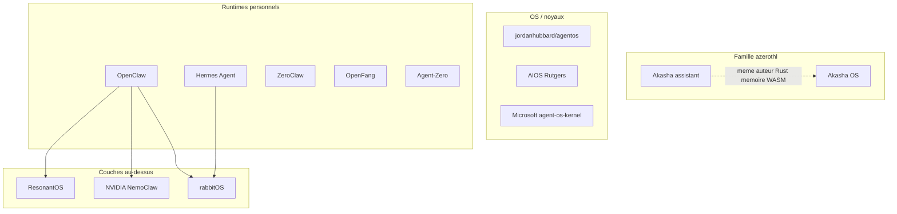

# Paysage concurrentiel — OS agentiques vs Akasha OS

**Langue :** [English](../competitive-landscape.md) | Français

> Date : 16/08/2026  
> Périmètre : projets publics ou connexes qui se présentent comme un « OS agentique », un runtime agent ou une couche d’exploitation agentique. Les claims marketing sont recoupés avec README / papers quand c’est possible. Beaucoup de projets disent « OS » sans livrer un noyau.

**Baseline Akasha OS :** Preview **0.8.0**, appli hôte (Windows/Linux + NVIDIA ; chemin CPU dans le même zip), pas une image bootable. Sources : [README.md](../../README.md), [FEATURES.md](FEATURES.md), [reflexion-agent-os.md](reflexion-agent-os.md), [specs-fonctionnelles.md](specs-fonctionnelles.md), [STATUS.md](STATUS.md).

---

## Ce qu’est Akasha OS

**Positionnement :** OS *agent-natif* — agents, modèles, outils et mémoire comme services système de premier plan, pas une appli posée sur POSIX. La Preview 0.8.0 tourne sur hôte ; une piste seL4 séparée (PV.1–PV.3) prépare le bare metal.

**Livré sur l’hôte :**

- Capacités logiques puis natives (`aos-caps` / `aos-capkd`)
- IPC sémantique (CBOR, intents typés)
- Runtime agent (goal loop, skills, MCP, sous-agents, steer / pause)
- Mémoire long terme + épisodique avec bootstrap mémoire-d’abord
- Modules WASM dual-surface (notes humain + agent)
- UI de module déclarative rendue par l’hôte (E15 ; pas de webview)
- Modèles locaux (llama.cpp CUDA), packs selon VRAM, batching continu, remote OpenAI-compat optionnel
- Offline-first, egress deny-by-default, confirmation fail-closed, audit hashé
- Trust manager + `cap.request`, politique déclarative
- UI egui : chat, agents, mémoire, notes, modèles, audit, settings (EN/FR)

**Hors Preview :** image bootable, macOS, marketplace, multi-utilisateur, multi-GPU complet, audio/vidéo natif.

---

## Taxonomie — ne pas comparer des pommes et des poires

| Couche | Définition | Exemples |
|--------|------------|----------|
| **A. OS / microkernel agent-natif** | Isolation matérielle, capacités, IPC, éventuellement boot | Akasha OS, [jordanhubbard/agentos](https://github.com/jordanhubbard/agentos) |
| **B. Kernel de recherche / gouvernance** | Services « OS-like » au-dessus de Linux | [AIOS](https://github.com/agiresearch/AIOS) (~6k★), [agent-os-kernel](https://pypi.org/project/agent_os_kernel/) (Microsoft), papier AOS (arXiv:2608.03214) |
| **C. Runtime personnel « Agent OS »** | Daemon userspace : gateway, tools, mémoire, canaux | [Akasha](https://github.com/azerothl/akasha) (sibling), [OpenClaw](https://openclaw.ai/) (~386k★), Hermes, ZeroClaw, OpenFang, Agent-Zero |
| **D. Couche expérience / flotte** | Dashboard, gouvernance, économie au-dessus d’un runtime | ResonantOS, Knowlee, clawREFORM |
| **E. Device / computer-use** | Contrôle GUI ou OS grand public | Adept ACT-1, rabbitOS 2.3, Windows + OpenClaw / WSL-C |

Les *frameworks* agents (LangGraph, CrewAI, AutoGen) ne sont **pas** des OS : exclus de la matrice.

Ne pas confondre [azerothl/akasha](https://github.com/azerothl/akasha) avec [ocuil/akasha-public](https://github.com/ocuil/akasha-public) (fabric mémoire stigmergique, autre auteur).

---

## Projet connexe : Akasha (azerothl/akasha)

**Pas un concurrent.** Même auteur (`azerothl`), même famille de marque, stack Rust. Le dépôt GitHub est actuellement **privé** (404 public). Version workspace **0.10.0**. Licence : propriétaire / à définir.

**Positionnement :** assistant personnel **sécurisé, local-first, 24/7** — infrastructure agentique *sur* un OS hôte. Couche **C**, pair interne d’OpenClaw / Hermes, **pas** d’Akasha OS.

**Monorepo Rust (aperçu) :** `akasha-core`, `akasha-daemon` (API :3876), `akasha-cli` / `akasha-tui`, `akasha-store` (SQLite + log immuable), `akasha-vault`, `akasha-llm` (routeur + fallback), `akasha-embedded-llm`, `akasha-embeddings`, `akasha-tools` + policy YAML, `akasha-plugin-host` (Wasmtime), `akasha-rag`, `akasha-cluster` (NATS), `akasha-calendar`, `akasha-workspace-graph`. UI : Tauri + React. Satellites : site app, code studio.

**Surface livrée (phases 0–9+) :** daemon always-on, orchestrateur non bloquant, Slack / Discord / Telegram, mémoire CT + LT (graphe de relations typées), vault / RBAC / redaction, plugins WASM, routeur LLM (embarqué / Ollama / OpenAI / OpenRouter), cluster, RAG + doctor advice, TTS/STT, Home Assistant, discovery, chemin CPU-capable.

| | Akasha (assistant) | Akasha OS (Preview 0.8.0) |
|--|--------------------|---------------------------|
| Thèse | Guest 24/7 sur Windows/Linux | OS agent-natif (caps, IPC, seL4) |
| Isolation | Politique outils + WASM + vault | Caps natives `aos-capkd` + WASM sans WASI ambiant |
| IPC | HTTP daemon :3876 + event envelope | Bus d’intents CBOR :24701 |
| GPU / placement | Routeur + Ollama / embarqué ; pas de Placement Manager OS | `modeld` + packs VRAM + batching continu |
| Offline | Embarqué + mode dégradé | `offline_strict` deny-by-default |
| Canaux | Slack / Discord / Telegram | aucun |
| Always-on / cron | daemon + calendrier + tâches | agents fond seulement |
| Voix / HA / cluster | oui | non |
| Modules dual-surface | plugins WASM (tools) | `.aospkg` humain + agent (notes + `declarative_ui`) |
| UI | TUI + Tauri React | egui natif |
| Licence | propriétaire | AGPL + commerciale |
| Maturité | v0.10.0, plus de surface produit | Preview 0.8.0, thèse OS plus poussée |

**Lecture :** Akasha *couvre déjà* une grande partie de ce qu’OpenClaw/Hermes vendent (canaux, 24/7, vault, routeur, CPU). Akasha OS *n’essaie pas* de recopier cette couche : il remonte d’un cran (caps, IPC sémantique, GPU-as-service, seL4). Les trous d’Akasha OS vs le marché C existent déjà dans le sibling — réutiliser plutôt que réimplémenter, sans diluer la thèse OS.

Réemploi plausible (documentation seulement ; pas de merge ici) : mémoire + graphe typé, vault, canaux, routeur LLM, plugins Wasmtime, calendrier/tâches.

---

## Pair OS le plus proche : jordanhubbard/agentos

Seul projet public qui vise le **même objet** qu’Akasha OS : OS bootable seL4, capacités, agents first-class — pas un framework Python. (Le sibling Akasha vise l’assistant, pas le noyau.)

| | Akasha OS | agentOS (Hubbard) |
|--|-----------|-------------------|
| Kernel | seL4 prévu ; Preview sur hôte + `aos-capkd` | seL4 Microkit, boot QEMU prouvé |
| Caps | `aos-capkd` mint/grant/revoke **déjà sur hôte** | ToolCap/ModelCap/MemCap ; services agents encore surtout scaffolding host-tested |
| IPC | intents CBOR sémantiques | contrats C Microkit |
| Inférence / GPU | first-class (placement, batching, packs VRAM) | pas le focus |
| UI humaine | egui Preview, dual-surface | « pas d’UI humaine requise » ; GUI dans un autre repo |
| Maturité produit | Preview installable 0.8.0 | ~20★, boot kernel oui, couche agent encore scaffolding |
| Licence | AGPL + commerciale | dépôt public, petit |

**Lecture :** Akasha OS est **plus avancé côté produit agent + GPU + UI** ; agentOS est **plus avancé côté boot bare-metal**. Ce sont des pairs, pas des clones d’OpenClaw.

---

## Runtimes personnels (là où le marché est)

### OpenClaw — le standard de fait

Gateway local, 20–29 canaux (WhatsApp, Telegram, Discord, Slack, Signal, iMessage…), skills `SKILL.md` + ClawHub, mémoire SQLite, cron, browser, voice, canvas, sandbox Docker optionnel (session `main` souvent **sans** sandbox). Windows natif via Execution Containers (Build 2026). Microsoft / NVIDIA s’y branchent.

**Vs Akasha OS :** OpenClaw gagne sur écosystème, canaux, always-on, computer-use léger, communauté. Akasha OS gagne sur capacités natives, IPC sémantique, GPU/placement, offline-strict, audit fail-closed, modules dual-surface. OpenClaw reste une **appli sur l’OS hôte** (thèse refusée par [website/why.html](../../website/why.html)). Le sibling Akasha est plus proche d’OpenClaw que d’Akasha OS sur cette couche.

### Hermes Agent (Nous Research)

Boucle d’apprentissage (skills auto-créées), mémoire inter-sessions, Honcho user-modeling, cron, sous-agents, plusieurs backends d’exécution (local, Docker, SSH, Modal, Daytona…), MCP, TUI + Desktop, Windows natif. Pas un OS : un agent auto-améliorant portable.

**Vs Akasha OS :** Hermes gagne sur apprentissage continu, portabilité, canaux, serverless. Akasha OS gagne sur isolation par caps, modèles locaux first-class, politique/audit noyau. Le sibling Akasha recoupe Hermes sur daemon 24/7, mémoire LT, slash, multi-canal.

### ZeroClaw / OpenFang / clawREFORM

Alternatives Rust « un binaire » autour de la niche OpenClaw : lean runtime, SOP, receipts crypto (ZeroClaw) ; claims sécu/WASM/canaux agressifs (OpenFang) ; self-rewrite + A2A (clawREFORM).

**Vs Akasha OS :** même couche C. Leurs claims sécu WASM/allowlists sont plus proches d’Akasha OS (et du plugin-host Wasmtime du sibling) que le sandbox optionnel d’OpenClaw, mais **pas** de kernel seL4, ni placement GPU OS-level, ni modules dual-surface.

### Agent-Zero

Docker = vrai bureau Linux pour l’agent (GUI + terminal + browser annoté) + pont hôte. Computer-use fort.

**Vs Akasha OS :** Agent-Zero *pilote* un OS généraliste ; Akasha OS *veut être* l’OS. Pas de caps natives / IPC sémantique / GPU-as-service.

---

## Recherche et gouvernance

### AIOS (Rutgers, COLM 2025, arXiv:2403.16971)

Kernel userspace : scheduling agents, context switch LLM, memory/storage/tool managers, SDK Cerebrum. Jusqu’à ~2,1× vs exécution naïve. ~6k★. Déjà cité dans [reflexion-agent-os.md](reflexion-agent-os.md).

**Vs Akasha OS :** même intuition (kernel à services). AIOS = recherche Python sur Linux, multi-framework. Akasha OS = caps + IPC sémantique + WASM dual-surface + placement GPU + piste seL4 + Preview utilisable.

### Microsoft agent-os-kernel

Kernel de **gouvernance** (policy, trust, observabilité, IATP), preview PyPI — pas un desktop OS. Complémentaire, pas un concurrent produit.

### Papier AOS (arXiv:2608.03214)

Architecture de référence (control plane + runtime plane). Utile comme grille d’évaluation, pas un produit.

---

## Plateformes et devices

- **NVIDIA NemoClaw :** installer / sandbox d’agents locaux sur RTX / DGX, option Hermes, WSL. Infra vendor, pas un OS souverain.
- **Windows 2026 :** OpenClaw dans Execution Containers, WSL-C. L’OS généraliste *accueille* les agents ; Akasha OS inverse le rapport.
- **rabbitOS 2.3 :** multi-agent grand public sur R1 (Hermes + OpenClaw + DLAM). OS device, pas desktop souverain.
- **Adept ACT-1 :** computer-use / action models entreprise. Pas de kernel, pas de mémoire OS, pas d’offline-first local.
- **ResonantOS / Knowlee :** cockpit, RAG, gouvernance, parfois token/DAO. Couche D.

---

## Matrice fonctionnelle

Légende : **oui** / **partiel** / **non** / **vision**. Colonne **Akasha** = sibling [azerothl/akasha](https://github.com/azerothl/akasha) v0.10.0, **pas** l’OS. Cellules Akasha OS = **Preview livrée** sauf mention vision.

| Capacité | Akasha OS | Akasha | agentOS seL4 | AIOS | OpenClaw | Hermes | ZeroClaw / OpenFang | Agent-Zero |
|----------|-----------|--------|--------------|------|----------|--------|---------------------|------------|
| Vrai noyau / isolation HW | partiel (hôte + piste seL4) | non | oui (boot QEMU) | non | non | non | non | Docker |
| Caps unforgeables / révocation | oui | partiel (policy + vault) | vision/partiel | partiel (ACL) | partiel (sandbox opt.) | partiel | partiel–oui (claims) | non |
| IPC / syscalls sémantiques | oui | HTTP + events | contrats C | syscalls agent | non (tools) | non | non | non |
| GPU first-class + placement | oui | partiel (Ollama/CUDA) | non | non | non | non | non | non |
| Offline-first + modèles embarqués | oui | oui (embarqué + dégradé) | n/a | partiel | partiel (BYO local) | partiel | partiel | partiel |
| Egress deny-by-default | oui | partiel (policy outils) | n/a | non | non (défaut host) | non | partiel | isolé Docker |
| Audit hashé + confirm fail-closed | oui | log immuable + approvals | prévu | partiel | partiel | partiel | receipts (ZC) | partiel |
| Trust / autonomie graduée | oui | trust store + RBAC | non | non | non | learning loop | conscience (claims) | non |
| Mémoire LT + bootstrap | oui | oui (graphe typé) | non | oui | oui | oui (plus riche) | oui | oui |
| Modules dual-surface WASM | oui | plugins WASM | non | non | skills md | skills | plugins | plugins |
| Skills / MCP | oui | skills + plugins | non | tools SDK | oui + ClawHub | oui | oui | oui |
| Multi-agent spawn / steer | oui | orchestrateur + workers | vision | oui | routing | sous-agents | oui | oui |
| Canaux chat (TG/Discord/…) | non | Slack/Discord/Telegram | non | non | **oui (20+)** | oui | oui | non |
| Computer-use / GUI | non | outils machine | non | non | browser | tools | browser | **oui (desktop)** |
| Always-on / cron | partiel (agents fond) | **oui** (daemon + calendrier) | non | scheduler | **oui** | **oui** | SOP/cron | non |
| macOS / CPU-only | non | oui (CPU / Ollama) | QEMU | oui | oui | oui | oui | oui |
| Marketplace | non (v1 local) | registre plugins | non | agents hub | ClawHub | skills | ClawHub-compat | non |
| Maturité / reach | Preview 0.2 | v0.10.0 privé | proto | recherche | **produit de masse** | produit | émergent | mature framework |

---

## Synthèse stratégique pour Akasha OS

**Akasha OS n’est pas en retard sur « l’OS agentique » au sens noyau.** Sur cette définition (caps, IPC sémantique, GPU-as-service, audit, WASM dual-surface, seL4), le seul pair public est agentOS — et Akasha OS a une Preview humaine plus complète.

**Le retard « assistant personnel » (couche C)** vs OpenClaw / Hermes est en grande partie **déjà couvert par le sibling Akasha** (canaux, daemon 24/7, vault, calendrier, voix, CPU/Ollama). Ce n’est pas un trou de la famille : c’est un trou *volontaire* d’Akasha OS si la thèse reste le noyau.

Quatre écarts structurels :

1. **Thèse OS vs thèse assistant** — OpenClaw et le sibling Akasha acceptent d’être des guests puissants ; Akasha OS refuse. Ne pas fusionner les deux produits sous un seul binaire.
2. **Inférence comme ressource OS** — ni le sibling ni les runtimes C n’ont de Placement Manager + batching continu + packs VRAM. Différenciateur OS le plus net.
3. **Surface duale** — notes WASM humain+agent (OS) vs plugins WASM tools-only (sibling). Même runtime Wasmtime, contrat différent.
4. **Marque** — deux « Akasha » Rust du même auteur : documenter clairement sibling vs OS (et distinct de ocuil/akasha-public).

Risques : (a) Hubbard/agentos rattrape la couche agent sur seL4 ; (b) Windows+OpenClaw+NemoClaw normalise l’agent-in-container ; (c) cohort Preview NVIDIA-only alors que le sibling sait déjà faire du CPU ; (d) duplication mémoire/WASM/routeur entre les deux repos si aucun pont n’est décidé.

Réponses produit priorisées (E1–E15, anti-roadmap) : [plan-evolutions.md](plan-evolutions.md).

---

## Sources (août 2026)

- Akasha OS : ce dépôt — README, FEATURES, STATUS, vision / réflexion, specs fonctionnelles
- Sibling Akasha : [github.com/azerothl/akasha](https://github.com/azerothl/akasha) (privé), README local / `spec/00_vision.md`
- [jordanhubbard/agentos](https://github.com/jordanhubbard/agentos)
- [agiresearch/AIOS](https://github.com/agiresearch/AIOS), arXiv:2403.16971
- [openclaw.ai](https://openclaw.ai/), [openclaw/openclaw](https://github.com/openclaw/openclaw)
- [NousResearch/hermes-agent](https://github.com/nousresearch/hermes-agent)
- [zeroclaw-labs/zeroclaw](https://github.com/zeroclaw-labs/zeroclaw), [RightNow-AI/openfang](https://github.com/rightnow-ai/openfang), [aegntic/clawreform](https://github.com/aegntic/clawreform)
- [agent0ai/agent-zero](https://github.com/agent0ai/agent-zero)
- [agent-os-kernel](https://pypi.org/project/agent_os_kernel/) (Microsoft)
- Architecture de référence AOS : arXiv:2608.03214
- NVIDIA NemoClaw / tooling Windows (blogs vendor, ComputeX / Build 2026)
- Notes rabbitOS 2.x ; couverture Adept computer-use
- ResonantOS, Knowlee (positionnement couche D)

Ne **pas** inventer de comptes d’étoiles GitHub pour `azerothl/akasha` (dépôt privé).
