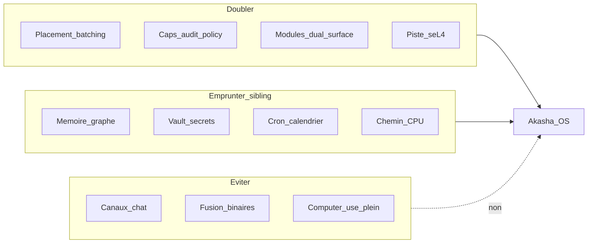

# Plan d’évolutions — Akasha OS (post-paysage)

**Langue :** [English](../evolution-roadmap.md) | Français

> Date : 19/08/2026  
> Statut : couche de priorisation (pas un nouveau numéro de phase P6)  
> Dérivé de : [paysage-concurrentiel.md](paysage-concurrentiel.md)  
> Lié à : [plan-developpement-phases.md](plan-developpement-phases.md), [FEATURES.md](FEATURES.md), [STATUS.md](STATUS.md), [reflexion-agent-os.md](reflexion-agent-os.md)

Ce document propose des **évolutions produit (E1–E19)** après l’enquête concurrentielle d’août 2026. Il **ne remplace pas** P0–P5 / PV / PC. Fermer d’abord la gate cohort PC ; ensuite planifier le travail E* au-dessus des livrables P5 / PV restants. Les incréments Preview (P03–P09) livrent déjà des E* sur l’hôte sans attendre cette gate cohorte.

---

## Principe directeur

D’après [paysage-concurrentiel.md](paysage-concurrentiel.md) :

- **Ne pas fusionner** Akasha OS et l’assistant sibling [Akasha](https://github.com/azerothl/akasha) en un seul binaire.
- **Ne pas viser** les 20+ canaux de chat d’OpenClaw dans le produit noyau.
- **Renforcer** ce qui manque aux runtimes couche C : placement GPU + batching, capacités natives, IPC sémantique, WASM dual-surface, piste seL4.
- Pour canaux / voix 24/7 / UX assistant CPU riche : **réutiliser ou pontuer** le sibling, ne pas réimplémenter.

---

## Horizon A — Court terme (Preview 0.3.0 — livré)

Objectif : cohort plus large + différenciateur OS plus visible, sans devenir un OpenClaw.

| ID | Évolution | Motivation concurrentielle | Ancrage repo |
|----|-----------|----------------------------|--------------|
| **E1** | **Chemin CPU-only / low-VRAM explicite** | Sibling + Hermes/OpenClaw tournent sans NVIDIA ; risque (c) du paysage | [FEATURES.md](FEATURES.md) ; packs first-run ; tier `cpu` ; packaging `-CpuOnly` |
| **E2** | **Scheduler agent OS** : intents `schedule.*` cap-gated (pas de canaux chat) | OpenClaw/Hermes/sibling gagnent sur always-on | `aos-agentd` + UI Settings + `var/schedules/` |
| **E3** | **2e module dual-surface** (`tasks`) | Différenciateur rare vs stacks skills-md only | [modules/tasks](../../modules/tasks) + onglet Tasks |
| **E4** | **Surface caps lisible** : lister + révoquer depuis l’UI | Receipts ZeroClaw / gouvernance MS | egui onglet Caps + `aos-capkd` |
| **E5** | **Métriques GPU dans l’UI** (TTFT, tok/s, VRAM) | Prouver le claim Placement Manager | `model.metrics` ; barre latérale + Models |

**Statut :** E1–E5 implémentés dans Preview **0.3.0** — [phase-preview-03.md](phases/phase-preview-03.md).  
E6 / E7-lite / E10-lite livrés dans Preview **0.4.0** — [phase-preview-04.md](phases/phase-preview-04.md).  
E14 livré dans Preview **0.5.0** — [phase-preview-05.md](phases/phase-preview-05.md).  
Export schémas E8 + contrat HTTP↔bus, keyring OS E7, catalogue local signé E10 livrés dans Preview **0.6.0** — [phase-preview-06.md](phases/phase-preview-06.md).  
**E15** (UI de module déclarative rendue par l’hôte) livré en Preview **0.7.0** — [phases/phase-preview-07.md](phases/phase-preview-07.md).  
**E16 + E17 + pack widgets E15 + onglet Providers F-MDL-04** livrés en Preview **0.8.0** — [phases/phase-preview-08.md](phases/phase-preview-08.md).  
**Prochaine Preview :** reste Horizon B (TPM E7, adaptateur HTTP live si planifié, multi-GPU E9) + clôture cohorte PC. **E18 + E19** livrés en Preview **0.9.0**.

**Hors scope court terme :** Telegram/Discord natifs, marketplace public, computer-use desktop, `sandboxed_webview`.

---

## Horizon B — Moyen terme (v0.x → v1 host)

| ID | Évolution | Motivation | Notes |
|----|-----------|------------|-------|
| **E6** | **Mémoire graphe typé** (`similar` / `updates` / …) + bootstrap enrichi | Sibling déjà riche ; Hermes LT ; A-MEM | **Livré 0.4.0** — emprunt conceptuel sibling `memory_relations`, pas de merge de code |
| **E7** | **Vault secrets** (keyring OS + caps d’usage ; jamais de clés brutes aux agents) | Vault sibling ; F-SEC-04 | **E7-lite 0.4.0** (`vault.enc` + DPAPI/0600) ; **E7-keyring 0.6.0** (CredMan / Secret Service, fallback fichier 0600) ; TPM plus tard |
| **E8** | **Pont sibling** (documenté + minimal) : schémas intents / mémoire / ABI WASM alignés ; plus tard option « Akasha assistant as module » | Risque (d) duplication | **Docs 0.4.0** — [sibling-bridge.md](sibling-bridge.md) ; **export schémas + contrat HTTP↔bus 0.6.0** ; **pas** un seul binaire |
| **E9** | **P5.2 multi-GPU** quand le hardware est dispo | Gate P5 partielle | [phases/phase-p5.md](phases/phase-p5.md) |
| **E10** | **Marketplace MCP / modules locale** (catalogue signé, revue de caps) | Distribution type ClawHub sans devenir ClawHub | **E10-lite 0.4.0** — revue de caps + exemple MCP ; **catalogue local signé 0.6.0** ; pas de store réseau |
| **E14** | **Extraction auto de faits du chat → mémoire long terme** | Le chat ne fait que *lire* `mem.context` ; les faits demandent Remember manuel | **Livré 0.5.0** — opt-in Settings ; extraction LLM post-tour → `mem.user.remember` + dédup/`supersedes` ; jamais de secrets auto |
| **E15** | **UI de module déclarative rendue par l’hôte** (arbre de widgets fermé dans egui ; pas de webview) | La dual-surface est un contrat ; Notes/Tasks sont codés à la main ; un module créé par un agent n’a pas de surface humaine | **Preview 0.7.0** — [phases/phase-preview-07.md](phases/phase-preview-07.md) ; **0.8.0 P08.11** élargit la liste fermée (`form` typé, `select`/`radio`/`checkbox`/`textarea`, `bar_chart`, `image`/`audio`) ; **pas** de HTML/JS ; **pas** E13 |
| **E16** | **Génération locale d’image + audio (TTS)** | Les testeurs attendent du multimodal sans API hébergée | **Preview 0.8.0** ✅ — [phases/phase-preview-08.md](phases/phase-preview-08.md) ; packs optionnels ; Download tire sd.cpp / piper dans `bin/` ; le Placement Manager possède la VRAM vs le LLM ; cap `media.generate` ; **pas** de vidéo ; **pas** de STT/voix always-on (sibling) ; familles extra / options CLI = **E19 / 0.9** |
| **E17** | **Artefact hôte CPU/GPU unifié** + politique device live | Le testeur devait choisir un zip CUDA ou CPU ; Settings auto/gpu/cpu seulement au prochain boot | **Preview 0.8.0** ✅ — un artefact par OS ; la session lance un backend sûr CUDA ou CPU ; bascule UI = restart modeld ; **auto** = hystérésis Placement Manager sur VRAM/CPU (et E16) ; le pin surcharge ; `-CpuOnly` = builder seulement ; **milieu de token sans cancel = E18 / 0.9** |
| **E18** | **Migration de device en milieu de token** (CPU ↔ GPU, le stream continue) | La bascule 0.8 annulait l’infer live | **Preview 0.9.0** ✅ — [phases/phase-preview-09.md](phases/phase-preview-09.md) ; rejeu de préfixe ; fallback fail-closed vers cancel+restart 0.8 |
| **E19** | **Média local extensible** (autres modèles d’image + options sd.cpp / Piper fermées + plugins chat) | 0.8 figeait SD 1.5 en 512² / 20 steps et deux voix Piper | **Preview 0.9.0** ✅ — [phases/phase-preview-09.md](phases/phase-preview-09.md) ; schéma JSON fermé ; Flux2/Ideogram4/Piper extra ; studio Image + carte TTS ; **pas** de vidéo ; **pas** d’img2img en intent de première classe |
| **E20** | **Leviers de decode local** (KV Q8, prefix cache `llama_state_*`, speculative prompt-lookup en C1) | TTFT / tok/s chat+agents sans adopter vLLM | **Preview 0.11.0** — [phases/phase-preview-11.md](phases/phase-preview-11.md) ; C1 seulement ; batch N>1 inchangé ; pas de second GGUF draft |

---

## Horizon C — Long terme (produit bare-metal)

| ID | Évolution | Motivation |
|----|-----------|------------|
| **E11** | **PV.4+ → bare metal** : même image, AccelDevice (P5.3) | Pair Hubbard/agentos ; la vraie course OS |
| **E12** | **Context switch cognitif préemptif** (F-AGT-03) | Context manager AIOS ; claim OS |
| **E13** | **Compositor / dual UI** au-delà de l’egui Preview (`sandboxed_webview` optionnelle sur fer nu) | [reflexion-agent-os.md](reflexion-agent-os.md) §7 ; pas prioritaire tant que la Preview hôte est le produit. Les dashboards Preview passent par **E15**. |

---

## Anti-roadmap (ne pas faire)

- Cloner 20+ canaux de messagerie dans le cœur produit OS → laisser au sibling ou à un module optionnel plus tard.
- Fusionner `akasha` + `akasha-os` en un binaire → confusion de marque + dilution de la thèse.
- Prioriser le computer-use type Adept/Agent-Zero avant caps + GPU + seL4.
- Marketplace public avant un registre local avec attestation de capacités.
- Ajouter un TCB Chromium/WebView2 à la Preview pour des dashboards de modules → hôte de widgets fermé (**E15**).
- Faire d’une API image/TTS hébergée le chemin par défaut au lieu d’un backend local géré par le Placement → E16 est local-first ; le distant est une option routée plus tard.
- Mettre un micro always-on / STT / voix 24/7 dans le cœur OS → sibling.
- Laisser un agent passer de l’argv sd.cpp / Piper brut → schéma d’options fermé (**E19**).

---

## Lien avec le plan de phases

| Couche | Rôle |
|--------|------|
| **P0–P5 / PV / PC** | Gates exécutables ([plan-developpement-phases.md](plan-developpement-phases.md), [STATUS.md](STATUS.md)) |
| **E1–E20** | Priorisation après analyse concurrentielle ; les incréments Preview P03–P11 livrent des E* sans attendre la gate cohort PC |

Ne **pas** inventer un numéro P6 tant que PC n’est pas fermé et que STATUS n’est pas à jour. E1–E5 livrés en Preview **0.3.0** ; E6 / E7-lite / E10-lite en **0.4.0** ; **E14** en **0.5.0** ; E8 schémas + E7-keyring + E10 catalogue en **0.6.0** ; **E15** hôte d’UI de module déclarative livré en Preview **0.7.0**. **E16 + E17 + pack widgets E15 + onglet Providers F-MDL-04** livrés en Preview **0.8.0**. **E18 + E19** livrés en Preview **0.9.0**. **E7 TPM + E8 live + E9** en **0.10.0**. **E20 decode local** en Preview **0.11.0** (P11). Puis fermeture cohort PC + Horizon C / PV.4+.

Séquençage suggéré une fois PC fermé (historique ; les incréments Preview
ont déjà joué cette séquence sur l’hôte en P03–P07, puis E16+E17 en P08) :

1. E5 (métriques) + E4 (UI caps) — prouver la thèse OS dans l’UI testeur  
2. E1 (chemin CPU) — élargir le cohort  
3. E2 (scheduler) + E3 (2e module dual-surface)  
4. Puis Horizon B (E6–E10) en parallèle du reste P5.2 / PV  

---

## Documents liés

- [paysage-concurrentiel.md](paysage-concurrentiel.md) — enquête qui motive les E*
- [plan-developpement-phases.md](plan-developpement-phases.md) — gates P0–P5 / PV / PC + incréments Preview P03–P09
- [FEATURES.md](FEATURES.md) — surface Preview livrée
- [specs-fonctionnelles.md](specs-fonctionnelles.md) — exigences F-* (notamment F-AGT-03, F-SEC-04, F-PLC-*)
- [phases/phase-p5.md](phases/phase-p5.md), [phases/phase-vm-sel4.md](phases/phase-vm-sel4.md), [phases/phase-pc.md](phases/phase-pc.md), [phases/phase-preview-07.md](phases/phase-preview-07.md), [phases/phase-preview-08.md](phases/phase-preview-08.md), [phases/phase-preview-09.md](phases/phase-preview-09.md)
- Sibling : [github.com/azerothl/akasha](https://github.com/azerothl/akasha) (privé)
