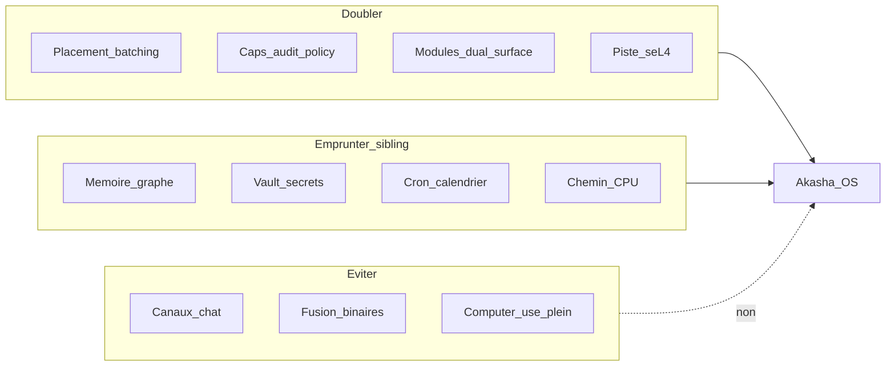

# Plan d’évolutions — Akasha OS (post-paysage)

**Langue :** [English](../evolution-roadmap.md) | Français

> Date : 16/08/2026  
> Statut : couche de priorisation (pas un nouveau numéro de phase P6)  
> Dérivé de : [paysage-concurrentiel.md](paysage-concurrentiel.md)  
> Lié à : [plan-developpement-phases.md](plan-developpement-phases.md), [FEATURES.md](FEATURES.md), [STATUS.md](STATUS.md), [reflexion-agent-os.md](reflexion-agent-os.md)

Ce document propose des **évolutions produit (E1–E13)** après l’enquête concurrentielle d’août 2026. Il **ne remplace pas** P0–P5 / PV / PC. Fermer d’abord la gate cohort PC ; ensuite planifier le travail E* au-dessus des livrables P5 / PV restants.

---

## Principe directeur

D’après [paysage-concurrentiel.md](paysage-concurrentiel.md) :

- **Ne pas fusionner** Akasha OS et l’assistant sibling [Akasha](https://github.com/azerothl/akasha) en un seul binaire.
- **Ne pas viser** les 20+ canaux de chat d’OpenClaw dans le produit noyau.
- **Renforcer** ce qui manque aux runtimes couche C : placement GPU + batching, capacités natives, IPC sémantique, WASM dual-surface, piste seL4.
- Pour canaux / voix 24/7 / UX assistant CPU riche : **réutiliser ou pontuer** le sibling, ne pas réimplémenter.

---

## Horizon A — Court terme (Preview 0.3.0 — livré)

Objectif : cohort plus large + différenciateur OS plus visible, sans devenir un OpenClaw.

| ID | Évolution | Motivation concurrentielle | Ancrage repo |
|----|-----------|----------------------------|--------------|
| **E1** | **Chemin CPU-only / low-VRAM explicite** | Sibling + Hermes/OpenClaw tournent sans NVIDIA ; risque (c) du paysage | [FEATURES.md](FEATURES.md) ; packs first-run ; tier `cpu` ; packaging `-CpuOnly` |
| **E2** | **Scheduler agent OS** : intents `schedule.*` cap-gated (pas de canaux chat) | OpenClaw/Hermes/sibling gagnent sur always-on | `aos-agentd` + UI Settings + `var/schedules/` |
| **E3** | **2e module dual-surface** (`tasks`) | Différenciateur rare vs stacks skills-md only | [modules/tasks](../../modules/tasks) + onglet Tasks |
| **E4** | **Surface caps lisible** : lister + révoquer depuis l’UI | Receipts ZeroClaw / gouvernance MS | egui onglet Caps + `aos-capkd` |
| **E5** | **Métriques GPU dans l’UI** (TTFT, tok/s, VRAM) | Prouver le claim Placement Manager | `model.metrics` ; barre latérale + Models |

**Statut :** E1–E5 implémentés dans Preview **0.3.0** — [phase-preview-03.md](phases/phase-preview-03.md).  
E6 / E7-lite / E10-lite livrés dans Preview **0.4.0** — [phase-preview-04.md](phases/phase-preview-04.md).

**Hors scope court terme :** Telegram/Discord natifs, marketplace public, computer-use desktop.

---

## Horizon B — Moyen terme (v0.x → v1 host)

| ID | Évolution | Motivation | Notes |
|----|-----------|------------|-------|
| **E6** | **Mémoire graphe typé** (`similar` / `updates` / …) + bootstrap enrichi | Sibling déjà riche ; Hermes LT ; A-MEM | **Livré 0.4.0** — emprunt conceptuel sibling `memory_relations`, pas de merge de code |
| **E7** | **Vault secrets** (keyring OS + caps d’usage ; jamais de clés brutes aux agents) | Vault sibling ; F-SEC-04 | **E7-lite 0.4.0** (`vault.enc` + DPAPI/0600) ; TPM plus tard |
| **E8** | **Pont sibling** (documenté + minimal) : schémas intents / mémoire / ABI WASM alignés ; plus tard option « Akasha assistant as module » | Risque (d) duplication | **Docs 0.4.0** — [sibling-bridge.md](sibling-bridge.md) ; **pas** un seul binaire |
| **E9** | **P5.2 multi-GPU** quand le hardware est dispo | Gate P5 partielle | [phases/phase-p5.md](phases/phase-p5.md) |
| **E10** | **Marketplace MCP / modules locale** (catalogue signé, revue de caps) | Distribution type ClawHub sans devenir ClawHub | **E10-lite 0.4.0** — revue de caps + exemple MCP ; pas de store réseau |
| **E14** | **Extraction auto de faits du chat → mémoire long terme** | Le chat ne fait que *lire* `mem.context` ; les faits demandent Remember manuel | **Candidat Preview 0.5** — opt-in Settings ; extraction LLM post-tour → `mem.user.remember` + dédup/`supersedes` ; jamais de secrets auto |

---

## Horizon C — Long terme (produit bare-metal)

| ID | Évolution | Motivation |
|----|-----------|------------|
| **E11** | **PV.4+ → bare metal** : même image, AccelDevice (P5.3) | Pair Hubbard/agentos ; la vraie course OS |
| **E12** | **Context switch cognitif préemptif** (F-AGT-03) | Context manager AIOS ; claim OS |
| **E13** | **Compositor / dual UI** au-delà de l’egui Preview | [reflexion-agent-os.md](reflexion-agent-os.md) §7 ; pas prioritaire tant que la Preview hôte est le produit |

---

## Anti-roadmap (ne pas faire)

- Cloner 20+ canaux de messagerie dans le cœur produit OS → laisser au sibling ou à un module optionnel plus tard.
- Fusionner `akasha` + `akasha-os` en un binaire → confusion de marque + dilution de la thèse.
- Prioriser le computer-use type Adept/Agent-Zero avant caps + GPU + seL4.
- Marketplace public avant un registre local avec attestation de capacités.

---

## Lien avec le plan de phases

| Couche | Rôle |
|--------|------|
| **P0–P5 / PV / PC** | Gates exécutables ([plan-developpement-phases.md](plan-developpement-phases.md), [STATUS.md](STATUS.md)) |
| **E1–E14** | Priorisation après analyse concurrentielle ; planifier **après** la fermeture de la gate cohort PC |

Ne **pas** inventer un numéro P6 tant que PC n’est pas fermé et que STATUS n’est pas à jour. E1–E5 livrés en Preview **0.3.0** ; E6 / E7-lite / E10-lite en **0.4.0**. Prochain focus : **E14** (chat→mémoire auto, candidat Preview 0.5) + reste Horizon B (E7 TPM, E8 runtime, E9 multi-GPU) + fermeture cohort PC.

Séquençage suggéré une fois PC fermé :

1. E5 (métriques) + E4 (UI caps) — prouver la thèse OS dans l’UI testeur  
2. E1 (chemin CPU) — élargir le cohort  
3. E2 (scheduler) + E3 (2e module dual-surface)  
4. Puis Horizon B (E6–E10) en parallèle du reste P5.2 / PV  

---

## Documents liés

- [paysage-concurrentiel.md](paysage-concurrentiel.md) — enquête qui motive les E*
- [plan-developpement-phases.md](plan-developpement-phases.md) — gates P0–P5 / PV / PC
- [FEATURES.md](FEATURES.md) — surface Preview livrée
- [specs-fonctionnelles.md](specs-fonctionnelles.md) — exigences F-* (notamment F-AGT-03, F-SEC-04, F-PLC-*)
- [phases/phase-p5.md](phases/phase-p5.md), [phases/phase-vm-sel4.md](phases/phase-vm-sel4.md), [phases/phase-pc.md](phases/phase-pc.md)
- Sibling : [github.com/azerothl/akasha](https://github.com/azerothl/akasha) (privé)
